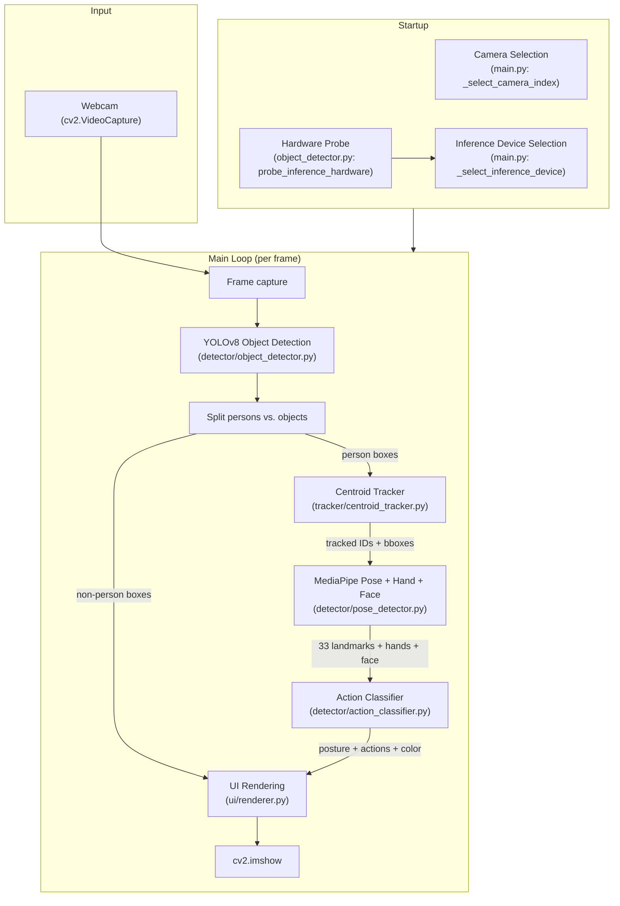
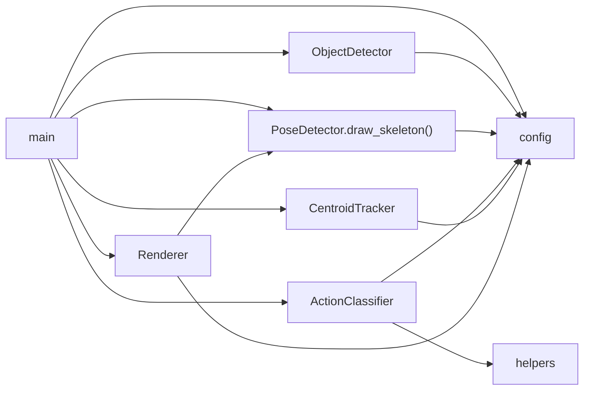

# Activity Detection System

AI Generated Documentation

This documentation was generated by AI through static analysis of the project's source code. It represents the implementation at the time it was generated and may become outdated as the code evolves. Always treat the source code as the ultimate source of truth.

---

Real-time webcam-based human activity detection system combining YOLOv8 object detection, MediaPipe pose estimation, centroid-based multi-person tracking, and rule-based action classification — rendered entirely with OpenCV.

---

## Purpose

This project exists to demonstrate real-time human activity understanding from a single webcam feed using off-the-shelf computer vision models combined with lightweight geometric heuristics. It solves the problem of identifying what people *are doing* (standing, sitting, walking, waving, making a V-sign) — not just where they are — without needing expensive multi-camera setups or deep learning action classifiers.

It is intended for AI lab demonstrations, prototyping, educational settings, and as a foundation for building privacy-local (no cloud) activity-aware applications.

---

## Features

- **YOLOv8 Object Detection** — Detects persons, laptops, monitors, keyboards, mice, chairs, and cell phones with per-class confidence thresholds and lab-scene geometric heuristics.
- **MediaPipe Pose Estimation** — 33 body keypoints extracted per detected person via the Tasks API.
- **Dense Face Features** — Optional MediaPipe Face Mesh integration for eyes, pupils/iris, lips, brows, and face contour overlays.
- **Hand Landmark Detection** — 21-point hand keypoints per hand for robust gesture classification.
- **Rule-Based Posture Classification** — Determines Standing, Sitting (Chair), or Sitting (Ground) using knee/hip angles, leg extension ratios, hip-to-frame ratios, and chair proximity.
- **Gesture Recognition** — Detects Saying Hello (raised hand with side-to-side sway), V Sign (index+middle finger spread with ring/pinky folded), and Walking (body translation + alternating ankle phase).
- **Contextual Action Detection** — Using laptop proximity and phone-to-face distance detection (implemented but not surfaced in default UI).
- **Temporal Stabilization** — Configurable hysteresis delays (1.0s posture, 0.45s actions) plus mode-based label history smoothing to eliminate flicker.
- **Centroid-Based Person Tracking** — Persistent IDs across frames with IoU + distance matching, EMA bbox smoothing, and confirmation gating (5-frame minimum before counting a person).
- **Duplicate Suppression** — IoU-based duplicate person removal to prevent ghost IDs from overlapping detections.
- **Multi-Camera Support** — Auto-scans available camera indexes (0–6), interactive selection at startup when multiple cameras are detected.
- **GPU Acceleration** — CUDA auto-detection with fallback to CPU; user prompt at startup when CUDA is available.
- **OpenCV-Only Live UI** — Bounding boxes with corner accents, semi-transparent info cards per person, top stats bar, bottom credits bar with FPS counter and GPU mode indicator.
- **Enhanced Skeleton Overlay** — Color-coded by body region (upper/lower/hand/face/foot) with configurable transparency and confidence-based thickness/radius.
- **Standalone Executable Build** — PyInstaller-based `build_exe.bat` packages everything into a self-contained Windows `dist/ActivityDetection/` folder.

---

## Tech Stack

| Category | Technology |
|---|---|
| Language | Python 3.10+ |
| Object Detection | Ultralytics YOLOv8 (`yolov8n.pt`) |
| Pose Estimation | Google MediaPipe Pose Landmarker (Tasks API) |
| Hand Landmarking | Google MediaPipe Hand Landmarker |
| Face Mesh | MediaPipe Face Mesh (solutions API) |
| Computer Vision | OpenCV 4.8+ |
| Numerical Computing | NumPy, SciPy |
| Deep Learning Runtime | PyTorch (CUDA / CPU) |
| Packaging | PyInstaller |
| Platform | Windows 10/11 |
| Package Manager | pip |
| Version Control | Git |

---

## Project Structure

```
Activity detection/
├── main.py                         # Application entry point, main loop, camera & device selection
├── config.py                       # All tunable constants (thresholds, colors, toggles, sizes)
├── requirements.txt                # Python package dependencies
├── setup.bat                       # One-time setup: venv, pip, PyTorch CUDA, model downloads
├── run.bat                         # Launch script with pre-flight validation
├── build_exe.bat                   # PyInstaller packaging script
├── ActivityDetection.spec          # PyInstaller spec file (alternative to build_exe.bat)
├── yolov8n.pt                      # YOLOv8 nano model weights (downloaded by setup.bat)
├── .gitignore                      # Git ignore rules
├── LICENSE                         # License file
│
├── detector/                       # Detection modules
│   ├── __init__.py
│   ├── object_detector.py          # YOLOv8 wrapper: inference, NMS, class filtering, hardware probing
│   ├── pose_detector.py            # MediaPipe Pose + Hand + Face Mesh integration
│   └── action_classifier.py        # Rule-based posture/gesture classification with temporal smoothing
│
├── tracker/                        # Tracking module
│   ├── __init__.py
│   └── centroid_tracker.py         # Centroid-based multi-object tracker with EMA smoothing
│
├── ui/                             # Rendering module
│   ├── __init__.py
│   └── renderer.py                 # OpenCV-based UI: boxes, labels, cards, bars, skeleton overlay
│
├── utils/                          # Shared utilities
│   ├── __init__.py
│   └── helpers.py                  # Geometry helpers: angle, distance, midpoint, bbox utilities
│
├── models/                         # Downloaded MediaPipe task models
│   ├── pose_landmarker_full.task   # Pose model (auto-downloaded)
│   └── hand_landmarker.task        # Hand model (auto-downloaded)
│
├── build/                          # PyInstaller build artifacts (git-ignored)
│   └── ActivityDetection/
├── dist/                           # PyInstaller output (git-ignored)
│   └── ActivityDetection/
│       └── ActivityDetection.exe
│
└── venv/                           # Python virtual environment (git-ignored)
```

### Key Files Explained

| File | Role |
|---|---|
| `main.py` | Orchestrates the entire pipeline: camera selection, inference device selection, component initialization, main capture-loop (detect → track → classify → render), FPS calculation, and cleanup. |
| `config.py` | Single source of truth for all tunable parameters — camera settings, model paths, detection thresholds, geometric heuristics, tracker parameters, action thresholds (angles, ratios), skeleton/UI colors, and debug toggles. |
| `detector/object_detector.py` | Probes CUDA hardware via `torch.cuda` and `nvidia-smi`, loads YOLO model, runs per-frame inference, applies class whitelist filtering, per-class confidence thresholds, geometric scene heuristics (chair aspect ratio, monitor aspect ratio, minimum person size), class aliasing (`tv` → `monitor`, `cell phone` → `phone`), and IoU-based duplicate person suppression. |
| `detector/pose_detector.py` | Downloads pose/hand models on first use, creates MediaPipe PoseLandmarker and HandLandmarker (Tasks API), optionally initializes Face Mesh (solutions API). Detects 33 body landmarks, 21-point hand landmarks, and dense face features per person crop. Draws color-coded skeleton overlay with confidence-based thickness/radius. |
| `detector/action_classifier.py` | Contains the complete rule engine: knee/hip angle computations, leg extension ratio, hip-to-frame ratio, chair proximity, history-based walking detection (body center shift + ankle phase alternation), hello waving (hand above shoulder + sway analysis), V-sign (index/middle finger spread + ring/pinky folding + face distance gating), and temporal stabilization via per-person state machines with configurable hysteresis delays. |
| `tracker/centroid_tracker.py` | Implements a simple yet robust centroid tracker: computes centroids from bounding boxes, builds cost matrix via `scipy.spatial.distance.cdist`, gates matches by max distance and min IoU, applies exponential moving average (EMA) smoothing to centroids and bboxes, requires `TRACKER_CONFIRM_FRAMES` consecutive matches before confirming a track. |
| `ui/renderer.py` | Pure OpenCV rendering: semi-transparent info cards with posture/gesture/face-status per person, corner-accented bounding boxes, object boxes with confidence labels, top bar (object count), bottom bar (YOLOv8 | MediaPipe | GPU/CPU mode | FPS), no-detection overlay, and skeleton drawing delegation to `pose_detector`. |

---

## Architecture



### Request / Data Flow

1. **Startup** — `main.py` probes available CUDA hardware via `probe_inference_hardware()` (checks `torch.cuda.is_available()`, `device_count()`, and `nvidia-smi` for GPU names). The user is prompted to select GPU or CPU when CUDA is available. Camera indexes 0–6 are scanned and the user selects one interactively (or auto-selects if only one is found).

2. **Initialization** — `ObjectDetector` (YOLOv8), `PoseDetector` (MediaPipe), `ActionClassifier`, `CentroidTracker`, and `Renderer` are instantiated. The webcam is opened at the configured resolution (default 1920×1080).

3. **Per-Frame Pipeline:**
   - **Frame Capture** — `cap.read()` grabs the next frame.
   - **YOLO Detection** — `ObjectDetector.detect()` runs inference. Results are filtered by class whitelist, per-class confidence, geometric heuristics (chair aspect ratio, monitor aspect ratio, minimum person size). Person duplicates (IoU ≥ 0.65) are suppressed.
   - **Track Update** — Person bounding boxes are fed to `CentroidTracker.update()`, which matches centroids + IoU to existing tracks, creates new tracks for unmatched detections, and marks unmatched existing tracks as disappeared (de-registered after 40 frames).
   - **Pose Estimation** — For each confirmed tracked person, `PoseDetector.detect()` crops the person region, runs MediaPipe PoseLandmarker, then runs HandLandmarker and optionally Face Mesh on the same crop. Landmarks are mapped back to absolute frame coordinates.
   - **Action Classification** — `ActionClassifier.classify()` computes knee/hip angles and leg extension ratios from body landmarks, checks chair proximity via object detections, classifies posture (Standing / Sitting on Chair / Sitting on Ground), then evaluates gestures (waving, V-sign, walking) using hand landmarks and temporal histories (per-person deques of hand positions, body centers, ankle phases).
   - **Temporal Stabilization** — Raw posture is first smoothed by mode over `POSTURE_HISTORY_FRAMES` (12), then gated by a 1.0s delay before label change. Raw actions are gated by a 0.45s delay. This prevents flicker from single-frame misclassifications.
   - **Rendering** — `Renderer.draw_object_box()` draws non-person object boxes. `Renderer.draw_person_box()` draws corner-accented person boxes with semi-transparent info cards (ID, gesture, posture, face status). `PoseDetector.draw_skeleton()` overlays the color-coded skeleton. `Renderer.draw_top_bar()` and `draw_bottom_bar()` overlay the stats bar and credits bar.
   - **Display** — `cv2.imshow()` outputs the composited frame. Pressing `Q` or `ESC` exits the loop.

4. **Cleanup** — Camera and MediaPipe resources are released, OpenCV windows are destroyed.

### Error Handling Strategy

- **Camera failure** — If the selected camera fails to open, `main.py` falls back to `CAMERA_INDEX` (0), then exits with a clear error message if still unavailable.
- **Frame read failure** — A single frame read failure logs a warning, sleeps 100ms, and retries instead of crashing.
- **No pose detected** — Persons without pose landmarks are shown as "Detected" / "Unknown" with a default gray color rather than skipped.
- **CUDA unavailability** — If the user requests GPU but CUDA is unavailable, `ObjectDetector` logs a warning and falls back to CPU. The `Renderer` reflects the actual running mode.
- **KeyboardInterrupt** — Caught gracefully; resources are released before exit.
- **Missing model files** — `setup.bat` and `run.bat` validate the presence of `yolov8n.pt`, `pose_landmarker_full.task`, and `hand_landmarker.task` before launching.

### State Management

The application is purely single-process, single-threaded with no persistent state. The `CentroidTracker` and `ActionClassifier` maintain per-person in-memory state:

- **Tracker state:** `OrderedDict` of object centroids, bounding boxes, disappearance counters, hit counters, age counters, and confirmation booleans.
- **Classifier state:** Per-person deques for hand positions (wave detection), nose positions (talking detection, disabled by default), body center positions and ankle phase values (walking detection), label history (posture smoothing), stable/pending posture strings, and stable/pending action sets — all cleaned up when a person's ID disappears.

---

## Core Components

### `main.py` — Application Entry Point

- **Inputs:** Webcam video stream, user camera/device selection.
- **Outputs:** Live OpenCV window with detection overlay.
- **Dependencies:** `config`, `ObjectDetector`, `PoseDetector`, `ActionClassifier`, `CentroidTracker`, `Renderer`, `cv2`, `numpy`.
- **Key Functions:**
  - `_probe_camera(index)` — Attempts to open a camera and returns its resolution.
  - `_list_available_cameras(max_index)` — Scans indexes 0..max_index for available cameras.
  - `_select_camera_index(default_index)` — Interactive camera selection when multiple are detected.
  - `_select_inference_device()` — Probes CUDA and prompts user for GPU/CPU selection.
  - `main()` — Pipeline orchestration.

### `detector/object_detector.py` — YOLOv8 Object Detector

- **Responsibility:** Run YOLOv8 inference per frame, filter detections for lab-relevant classes, apply confidence thresholds and geometric heuristics.
- **Inputs:** BGR frame (numpy array).
- **Outputs:** List of detection dicts with `bbox`, `confidence`, `class_id`, `class_name`, `raw_class_name`.
- **Key Methods:**
  - `probe_inference_hardware()` — Static function returning CUDA capability details.
  - `_resolve_device(preference)` — Maps user preference ("cuda"/"cpu") to actual device.
  - `detect(frame)` — Runs `model.predict()`, filters by `YOLO_ALLOWED_CLASSES`, `YOLO_CLASS_CONFIDENCE`, geometric heuristics, and duplicate suppression.
  - `_suppress_person_duplicates(detections)` — IoU-based non-maximum suppression for persons only.

### `detector/pose_detector.py` — MediaPipe Pose + Hand + Face

- **Responsibility:** Extract 33 body landmarks, 21-point hand landmarks, and dense face features per person.
- **Inputs:** Full BGR frame + person bounding box (x1, y1, x2, y2).
- **Outputs:** Dict mapping landmark names to `(x_pixel, y_pixel, visibility)`.
- **Key Methods:**
  - `detect(frame, bbox)` — Crops person region, runs PoseLandmarker → HandLandmarker → FaceMesh, maps landmarks to frame coordinates.
  - `draw_skeleton(frame, landmarks, alpha, show_confidence)` — Draws color-coded skeleton overlay with hand/foot emphasis.
  - `_detect_hand_landmarks(crop_rgb, ...)` — Runs HandLandmarker on crop, maps to frame coords.
  - `_detect_face_features(crop_rgb, ...)` — Runs FaceMesh, groups points into chains (eyes, brows, lips, iris, face oval).
- **Landmark Constants:** `LANDMARK_NAMES` (33 pose), `POSE_CONNECTIONS` (skeleton edges), `HAND_LANDMARK_NAMES` (21 hand), `HAND_CONNECTIONS`, `FACE_CHAIN_INDICES`, `FACE_IRIS_INDICES`.

### `detector/action_classifier.py` — Rule-Based Action Classifier

- **Responsibility:** Classify posture and gestures from pose + hand landmarks using geometric rules and temporal smoothing.
- **Inputs:** `person_id`, `landmarks` dict, `frame_shape`, `object_detections`.
- **Outputs:** Dict with `posture`, `raw_posture`, `posture_confidence`, `actions`, `raw_actions`, `color`.
- **Key Methods:**
  - `classify(person_id, landmarks, frame_shape, object_detections)` — Entry point: posture classification → label smoothing → action classification → stabilization.
  - `_classify_posture(kp, frame_h, object_detections)` — Multi-rule cascade: checks ground sitting (hip ratio / hip-ankle diff), then chair sitting (bent knee + hip, compact leg, chair proximity), then standing (straight knee + open hip + leg extension), with soft fallbacks.
  - `_is_saying_hello(person_id, kp)` — Checks hand above shoulder + side-to-side sway analysis from history deque.
  - `_is_v_sign(kp)` — Checks index/middle finger spread, finger extension, ring/pinky folding, thumb-to-spread ratio, face distance.
  - `_is_walking(person_id, kp, posture)` — Checks body center horizontal net shift + per-frame shift + ankle lead alternation.
  - `_is_near_chair(kp, object_detections)` — Spatial proximity check between hip center and detected chair bounding boxes.
  - `_stabilize_posture(person_id, raw_posture, now_ts)` — 1.0s hysteresis gate.
  - `_stabilize_actions(person_id, raw_actions, now_ts)` — 0.45s per-action hysteresis gate.
  - `cleanup_person(person_id)` — Removes all per-person state when a track disappears.

### `tracker/centroid_tracker.py` — Centroid-Based Person Tracker

- **Responsibility:** Maintain persistent person IDs across frames using centroid matching.
- **Inputs:** List of `(x1, y1, x2, y2)` bounding boxes.
- **Outputs:** `OrderedDict` of `{person_id: bbox}`.
- **Key Methods:**
  - `update(detections)` — Compute centroids, build pairwise distance matrix (scipy `cdist`) + IoU matrix, gate by `TRACKER_MAX_DISTANCE` and `TRACKER_MIN_IOU_MATCH`, match with sorted score, apply EMA smoothing, deregister objects exceeding `TRACKER_MAX_DISAPPEARED`.
  - `get_confirmed_tracks()` — Returns only tracks exceeding `TRACKER_CONFIRM_FRAMES` (default 5).
  - `_register(centroid, bbox)` / `_deregister(obj_id)` — Track lifecycle.

### `ui/renderer.py` — OpenCV UI Renderer

- **Responsibility:** Render all visual elements on the frame.
- **Inputs:** Frame, detection/tracking/classification results.
- **Outputs:** Frame modified in-place with visual overlays.
- **Key Methods:**
  - `draw_person_box(frame, bbox, person_id, posture, actions, color, landmarks)` — Corner-accented bounding box + semi-transparent info card.
  - `draw_object_box(frame, bbox, class_name, confidence)` — Simple colored box with label for non-persons.
  - `draw_top_bar(frame, stats)` — Dark bar at top showing detected object count.
  - `draw_bottom_bar(frame, fps)` — Dark bar at bottom showing model credits, GPU mode, and FPS.
  - `draw_no_detection_message(frame)` — Centered "No persons detected" pill.
  - `draw_person_debug(frame, bbox, person_id, result)` — Optional debug overlay (posture details, track status).
  - `_select_gesture(actions)` — Maps action list to UI label (priority: V Sign > Saying Hello > Walking > Neutral).
  - `_format_posture(posture)` — Converts internal posture names to display names ("Sitting (Chair)" → "Sitting on Chair").

### `utils/helpers.py` — Geometry Utilities

- `calculate_angle(a, b, c)` — Angle at point B formed by A-B-C (degrees) using dot product.
- `distance(p1, p2)` — Euclidean distance.
- `midpoint(p1, p2)` — Midpoint.
- `clamp(value, lo, hi)` — Clamp.
- `bbox_center(bbox)` / `bbox_area(bbox)` — Bounding box helpers.
- `smooth_value(history, new_value, max_len)` — Mode-based value smoothing.

---

## APIs

The project does not expose any external HTTP/gRPC APIs. All processing is local, single-process, single-threaded. The "APIs" consumed are:

| API / SDK | Purpose | Authentication | Usage |
|---|---|---|---|
| Ultralytics YOLO Python SDK | Object detection inference | None (local model file) | `detector/object_detector.py` |
| MediaPipe Tasks Python API (PoseLandmarker, HandLandmarker) | Body and hand keypoint extraction | None (local task model) | `detector/pose_detector.py` |
| MediaPipe Python Solutions API (FaceMesh) | Dense face landmark detection | None (built-in model) | `detector/pose_detector.py` |
| OpenCV Python (`cv2.VideoCapture`, `cv2.imshow`) | Camera capture and display | None | `main.py`, `ui/renderer.py` |
| PyTorch (`torch.cuda`) | CUDA device detection | None | `detector/object_detector.py` |
| `nvidia-smi` (subprocess) | GPU name detection | None (CLI tool) | `detector/object_detector.py` |

Model files are auto-downloaded from Google Cloud Storage and GitHub Releases via `setup.bat` / `pose_detector.py`:

- `https://storage.googleapis.com/mediapipe-models/pose_landmarker/pose_landmarker_full/float16/latest/pose_landmarker_full.task`
- `https://storage.googleapis.com/mediapipe-models/hand_landmarker/hand_landmarker/float16/latest/hand_landmarker.task`
- `https://github.com/ultralytics/assets/releases/download/v8.3.0/yolov8n.pt`

---

## Environment Variables

The project uses no environment variables. All configuration is done through `config.py` constants and `setup.bat` / `build_exe.bat` scripts.

---

## Database

The project does not use any database. No data is persisted between sessions.

---

## Configuration

### `config.py`

The single configuration file (185 lines) contains all tunable constants organized by concern:

| Section | Key Parameters |
|---|---|
| Camera | `CAMERA_INDEX` (0), `CAMERA_WIDTH` (1920), `CAMERA_HEIGHT` (1080), `CAMERA_ASK_ON_STARTUP` (True), `CAMERA_SCAN_MAX_INDEX` (6) |
| YOLO | `YOLO_MODEL` ("yolov8n.pt"), `YOLO_CONFIDENCE` (0.35), `YOLO_IOU_THRESHOLD` (0.55), `YOLO_ALLOWED_CLASSES` (7 classes), `YOLO_CLASS_CONFIDENCE` (per-class), `YOLO_CLASS_ALIASES`, `CHAIR_MAX_ASPECT_RATIO` (1.20), `MONITOR_MIN_ASPECT_RATIO` (1.10), `YOLO_MIN_PERSON_HEIGHT` (100), `YOLO_MIN_PERSON_AREA` (10000), `PERSON_DUPLICATE_IOU` (0.65) |
| Pose | `POSE_MIN_DETECTION_CONF` (0.55), `POSE_MIN_TRACKING_CONF` (0.55), `POSE_MODEL_COMPLEXITY` (1), `LANDMARK_VISIBILITY_MIN` (0.35) |
| Hand | `HAND_MIN_DETECTION_CONF` (0.45), `HAND_MIN_TRACKING_CONF` (0.45) |
| Face Mesh | `FACE_MESH_ENABLED` (True), `FACE_MESH_MIN_DETECTION_CONF` (0.45) |
| Tracker | `TRACKER_MAX_DISAPPEARED` (40), `TRACKER_MAX_DISTANCE` (120), `TRACKER_MIN_IOU_MATCH` (0.06), `TRACKER_CONFIRM_FRAMES` (5), `TRACKER_SMOOTHING_ALPHA` (0.45) |
| Actions | Standing angle thresholds, sitting angle thresholds, leg extension ratios, hip ratios, temporal delays (`POSTURE_SWITCH_DELAY_SEC` = 1.0, `ACTION_SWITCH_DELAY_SEC` = 0.45, `POSTURE_HISTORY_FRAMES` = 12), waving/detection thresholds, walking thresholds, V-sign thresholds, talking thresholds (disabled) |
| Skeleton | `SKELETON_ENABLED` (True), `SKELETON_ALPHA` (0.55), color constants for upper/lower/hand/face/foot/eye/iris/lips, face feature toggles |
| UI | Colors for standing/sitting/ground/default/object/unconfirmed, bar colors, font sizes, `BAR_HEIGHT` (48), `WINDOW_NAME` |
| Debug | `DEBUG_SHOW_POSTURE_DETAILS` (False), `DEBUG_SHOW_TRACK_STATUS` (False) |
| GPU | `ASK_GPU_ON_STARTUP` (True), `GPU_DEFAULT_USE_CUDA` (True) |

### `ActivityDetection.spec`

PyInstaller spec file defining:
- Entry point: `main.py`
- Data files: `models/` directory and `yolov8n.pt`
- Hidden imports: `ultralytics`, `mediapipe` and all submodules
- Output: one-directory build named `ActivityDetection`

### `setup.bat`

Automated setup for Windows:
1. Validates Python 3.10+ (warns for 3.13+ about CUDA wheel availability).
2. Creates fresh virtual environment.
3. Installs PyTorch with CUDA 12.1 from `download.pytorch.org` (falls back to CPU-only if CUDA install fails).
4. Installs remaining dependencies from `requirements.txt`.
5. Downloads `pose_landmarker_full.task`, `hand_landmarker.task`, and `yolov8n.pt` if not present.

### `run.bat`

Production launch script:
- Validates virtual environment existence.
- Validates all three model files.
- Validates Python package availability.
- Launches `main.py`.
- Captures exit code and pauses on error.

### `build_exe.bat`

Standalone executable builder:
- Validates virtual environment and all model files.
- Installs PyInstaller.
- Cleans previous build artifacts.
- Runs PyInstaller with `--onedir` mode, bundling models and all mediapipe submodules.
- Outputs to `dist/ActivityDetection/ActivityDetection.exe`.

### `.gitignore`

Ignores: `__pycache__/`, `*.py[cod]`, `venv/`, `.venv/`, `build/`, `dist/`, `*.egg-info/`, test caches, coverage, logs, IDE files, OS files.

---

## Dependencies

### Python Packages (`requirements.txt`)

| Package | Version | Purpose |
|---|---|---|
| `opencv-python` | ≥ 4.8.0 | Camera capture, image processing, UI rendering |
| `ultralytics` | ≥ 8.0.0 | YOLOv8 object detection |
| `mediapipe` | ≥ 0.10.0 | Pose, hand, and face landmark estimation (Tasks API) |
| `numpy` | ≥ 1.24.0 | Array operations, landmark math |
| `scipy` | ≥ 1.10.0 | `cdist` for pairwise distance computation in tracker |
| `torch` + `torchvision` | (installed separately via `setup.bat`) | YOLO inference backend, CUDA device detection |

### Internal Module Dependencies



---

## Installation

**Prerequisites:** Windows 10/11, Python 3.10–3.12 (3.13 may have CUDA compatibility issues), webcam, NVIDIA GPU with CUDA (recommended but optional).

```bat
:: Clone or download the project, then:
setup.bat
```

`setup.bat` automates everything: virtual environment creation, PyTorch (CUDA 12.1) installation, pip dependencies, and model file downloads. See [Configuration → setup.bat](#set-up-bat) for details.

---

## Running

```bat
:: Development / Production
run.bat

:: Or directly:
python main.py
```

**Controls:**

| Key | Action |
|---|---|
| `Q` | Quit |
| `ESC` | Quit |

**At startup:**

1. If CUDA GPU is detected, you will be prompted: `Use GPU for inference? [Y/n]:` — press Enter for the default (GPU) or type `n` for CPU.
2. If multiple cameras are detected, you will be prompted: `Select camera index [0]:` — enter the desired index or press Enter for the default.

**Build Executable:**

```bat
build_exe.bat
:: Output: dist\ActivityDetection\ActivityDetection.exe
```

**Lint / Format:**

The project does not define linting or formatting scripts. The `.gitignore` references `.ruff_cache` and `.mypy_cache`, suggesting ruff and mypy may be used locally.

---

## How It Works

1. **You run `run.bat`** (or `python main.py`). The application probes your hardware for CUDA-capable GPUs. If found, it can ask whether to use GPU or CPU. It then scans for available webcams (0–6) and either auto-selects or prompts for your choice.

2. **The main loop starts.** Each frame from the webcam is:
   - Run through **YOLOv8** to detect objects. Only lab-relevant classes pass through (person, laptop, monitor, keyboard, mouse, chair, cell phone). Persons are separated from other objects.
   - Person bounding boxes go to the **centroid tracker**, which matches them to existing tracked persons by spatial proximity. A new person gets a fresh ID; a missing person's ID is recycled after 40 frames. Each track must be seen for 5 consecutive frames before it is "confirmed."
   - For each confirmed person, the corresponding image region is cropped and passed to **MediaPipe Pose**, **Hand**, and **Face** landmarkers. Up to 33 body keypoints, 42 hand keypoints (21 per hand), and 478 face mesh points are extracted.
   - Landmarks feed into the **action classifier**: knee and hip angles determine if the person is standing, sitting on a chair, or sitting on the ground. Hand positions relative to the shoulder, finger spreads, and temporal histories determine gestures (waving, V-sign). Body center translation and ankle lead alternation detect walking.
   - A **hysteresis system** prevents label flicker: posture must change for 1 full second before updating; actions need 0.45 seconds.
   - The **renderer** draws everything: dark top bar with object count, color-coded bounding boxes with corner accents, semi-transparent info cards showing ID/gesture/posture/face status, skeleton overlay (colored by body region), and a dark bottom bar with model credits, GPU mode, and FPS.

3. **You press Q** (or ESC) to quit. The camera and MediaPipe resources are cleanly released.

---

## Current Status

**Development / Demo**

Evidence:
- The banner text reads "Real-time Lab Demo" (`main.py:170`).
- The window title is "Activity Detection - Live Demo" (`config.py:181`).
- Several features are implemented but disabled or not surfaced in the UI (talking detection is `TALKING_ENABLED = False`; `_is_using_phone` and `_is_using_laptop` methods exist in the classifier but are not called in the `classify()` output; `draw_person_debug` is not invoked in the main loop).
- No test suite, CI/CD pipeline, or production deployment configuration exists.
- `build_exe.bat` suggests the project is mature enough for standalone distribution.

---

## Known Limitations

- **No talking detection in UI** — The `_is_talking()` method exists in `ActionClassifier` but `TALKING_ENABLED` defaults to `False` and the result is not surfaced in the renderer.
- **Phone and laptop detection not surfaced** — `_is_using_phone()` and `_is_using_laptop()` are implemented but never called in the `classify()` return value. The logic exists but the results are not displayed.
- **Walking detection requires standing posture** — Walking is only classified when the current posture is "Standing", which may miss walking while sitting down to stand up transitions.
- **No talking detection due to disabled feature** — The talking detection code is complete but gated by `TALKING_ENABLED = False`. No UI space exists to display it either.
- **Single-threaded pipeline** — YOLO inference, MediaPipe inference, and rendering all run sequentially in one thread. FPS can drop significantly on CPU or with heavy models.
- **Windows-only scripts** — `setup.bat`, `run.bat`, and `build_exe.bat` are Windows batch files. No Linux/macOS equivalents are provided.
- **No persistent state** — Tracking and classification state resets on every application restart. No video recording or logging of detected activities.
- **Fixed camera resolution** — The camera is configured for 1920×1080. Lower resolutions may not be tested and geometric heuristics (hip ratios, pixel thresholds) are calibrated for this resolution.
- **No OOP abstraction for action categories** — The `ACTION_ORDER` list and individual `_is_*` methods are hardcoded rather than plugin-based, making extension with new actions require modifying the classifier source.
- **PyInstaller builds may be large** — Due to `--collect-all mediapipe`, the packaged executable directory is several hundred megabytes.
- **TODOs in code:** Naming conventions suggest this is a demo/lab project (folder named "Activity detaction" with typo, `HELLO_MOVEMENT_RATIO` constants, etc.).

---

## Future Improvements

- Enable and display phone, laptop, and talking detection in the UI.
- Add video recording / activity logging with timestamps.
- Implement multi-threaded inference (separate thread for YOLO, another for MediaPipe).
- Create Linux/macOS setup scripts.
- Add a plugin/registry system for new action classifiers.
- Replace centroid tracker with a Kalman filter or SORT/DeepSORT for better occlusion handling.
- Add a configuration UI overlay (toggleable debug info, adjust thresholds at runtime).
- Add screen recording or snapshot functionality.
- Implement a simple REST API or WebSocket server to stream detections to external applications.
- Add unit tests for angle calculations and classification rules.
- Reduce PyInstaller bundle size by excluding unnecessary MediaPipe components.

---

## License

Copyright (c) 2026 Babar Meet. All rights reserved.

No permission is granted to use, copy, modify, merge, publish, distribute, sublicense, create derivative works from, reference, reverse engineer for replication, or otherwise exploit this project, in whole or in part, for any purpose without prior written permission from the copyright holder.

---

## Credits

- [Ultralytics YOLOv8](https://github.com/ultralytics/ultralytics)
- [Google MediaPipe](https://mediapipe.dev/)
- [OpenCV](https://opencv.org/)
